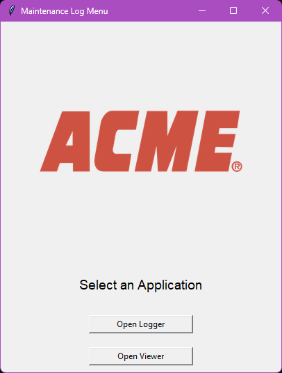
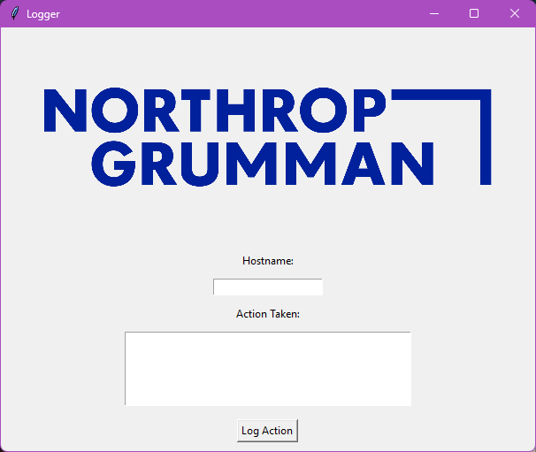
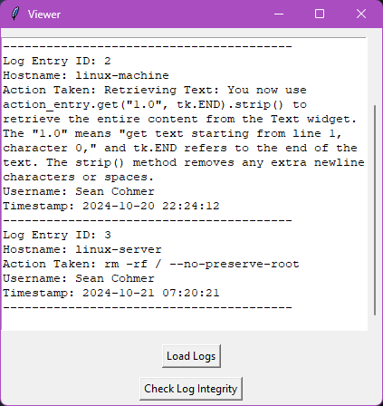
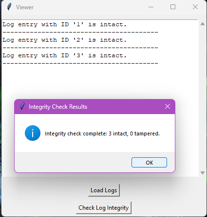

# sysadmin logging application
1. Main menu
2. Logger
3. Viewer

git clone the repo

modify SALT_GEN variable within .env with a value to encrypt/decrypt log entries.
modify SHARED_PATH variable within .env with a shared folder path where the log entries will be stored.
modify LOGO_IMG variable within .env with the path to your company logo

Run install.bat from CMD

## Screenshots

